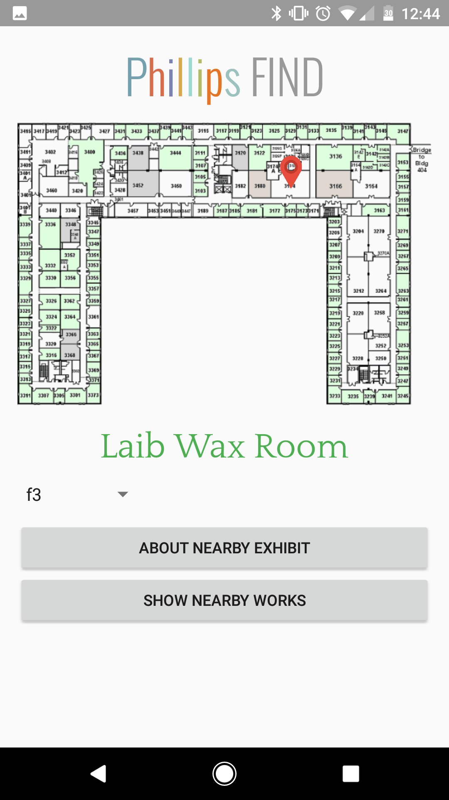
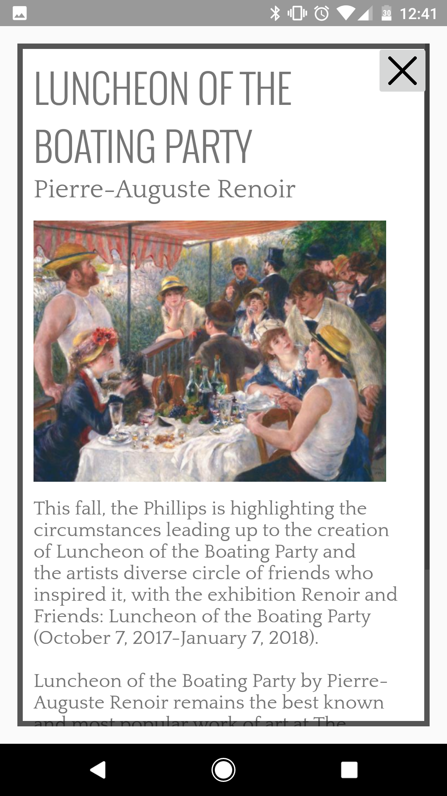
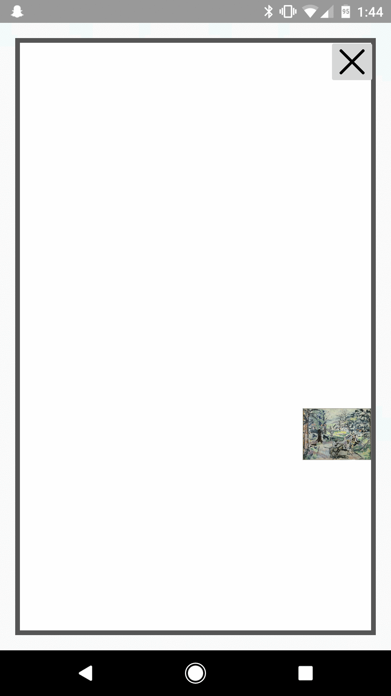
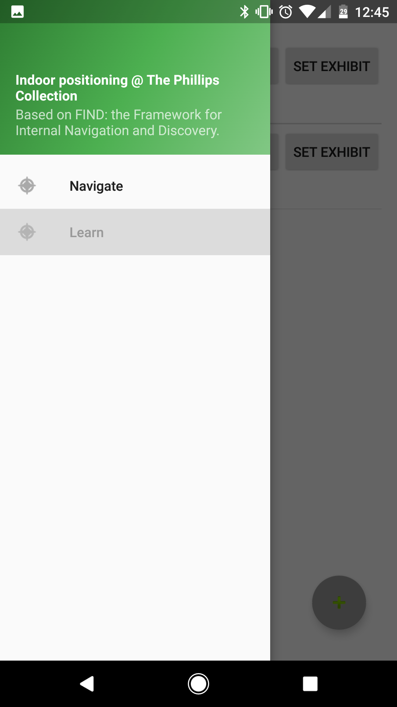
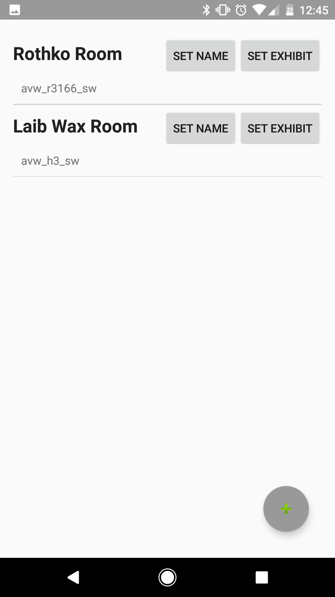
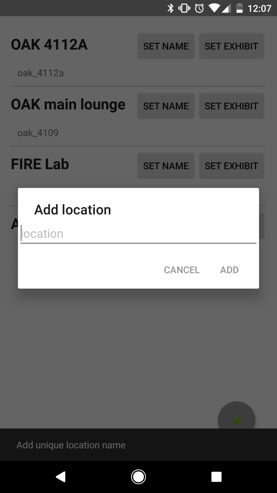

# Phillips FIND

This app is an extension of the FIND Android Client indoor positioning system, built for the needs of the Phillips Collection in DC, as my fall 2017 project for the FIRE program at the University of Maryland.
 - **Navigate**: view your current room on a floorplan of the Phillips Collection, based on FIND's "Track" function (RSSI-based Wifi positioning)
    - **Exhibit Info**: view a featured image and description about the exhibit in the current location
    - **Nearby Works**: view nearby works, animated so that images of works grow as they are moved towards and shrink as they are moved away from
 - **Learn**: For museum curators, create new locations, associate locations with exhibits, and select locations on the floor plan (connects to the FIND server to submit fingerprints) (temporary)

----------

**About FIND**

The **Framework for Internal Navigation and Discovery (FIND)** allows you to use your (Android) smartphone or WiFi-enabled computer (laptop or Raspberry Pi or etc.) to determine your position within your home or office. You can easily use this system in place of motion sensors as its resolution will allow your phone to distinguish whether you are in the living room, the kitchen or the bedroom, etc. The position information can then be used in a variety of ways including home automation, way-finding, or tracking!
To learn more about it or to run your own private server, check out https://github.com/schollz/find

----------
**Getting Started**

These instructions will get you a copy of the project up and running on your local machine for development and testing purposes. 

Clone the project to your local machine:
```
$ git clone git://github.com/keller-mark/find-app-android
```

Import the app into Android Studio as an existing project.

To turn learn mode on and off, toggle the `LEARN_MODE` boolean variable in `internal/Constants.java`.

**Beacon Functionality**
To use beacon functionality to show nearby works, obtain a Nearby Messages API key from the Google Developer console. See [https://developers.google.com/nearby/messages/android/get-started#step_3_get_an_api_key](https://developers.google.com/nearby/messages/android/get-started#step_3_get_an_api_key) for instructions.

Create a `secrets.xml` file in the `app/res/values` directory. Add a string resource 
```
<string name="nearby_messages_api_key">YOUR_API_KEY_HERE</string>
```

Configure beacons as Eddystone-UID beacons in the namespace `00000000000000000001`. For each beacon instance, associate the int value of the instance with a `MuseumWork` object in the `beaconWorkMap` in `internal/Constants.java`.

----------
**App Screenshots**

*Main Activity - Track on Floor Plan*



*About Nearby Exhibit*



*Nearby Works*



*Learn Mode - Menu*



*Learn Mode - Locations*



*Learn Mode - Add Location*



----------

**License**

The code supplied here is covered under the MIT Open Source License:

Copyright (c) 2016 Akshay Dekate

Permission is hereby granted, free of charge, to any person obtaining a copy of this software and associated documentation files (the "Software"), to deal in the Software without restriction, including without limitation the rights to use, copy, modify, merge, publish, distribute, sublicense, and/or sell copies of the Software, and to permit persons to whom the Software is furnished to do so, subject to the following conditions:

The above copyright notice and this permission notice shall be included in all copies or substantial portions of the Software.

THE SOFTWARE IS PROVIDED "AS IS", WITHOUT WARRANTY OF ANY KIND, EXPRESS OR IMPLIED, INCLUDING BUT NOT LIMITED TO THE WARRANTIES OF MERCHANTABILITY, FITNESS FOR A PARTICULAR PURPOSE AND NONINFRINGEMENT. IN NO EVENT SHALL THE AUTHORS OR COPYRIGHT HOLDERS BE LIABLE FOR ANY CLAIM, DAMAGES OR OTHER LIABILITY, WHETHER IN AN ACTION OF CONTRACT, TORT OR OTHERWISE, ARISING FROM, OUT OF OR IN CONNECTION WITH THE SOFTWARE OR THE USE OR OTHER DEALINGS IN THE SOFTWARE.

----------
